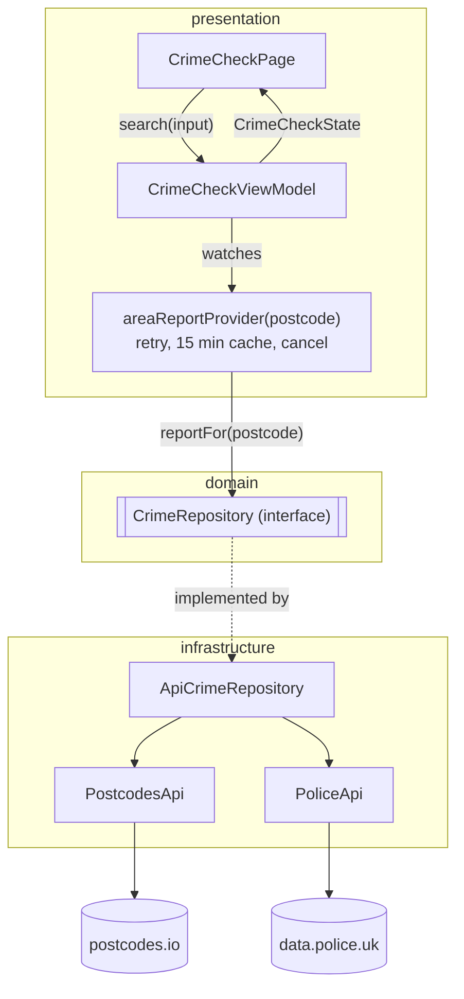

# Safer Streets

Type a UK postcode and see whether street crime nearby went up or down last month, with the totals for both months and each category's change. One screen, one question, answered plainly.

**Track 02, UK Crime & Safety Explorer**, using [data.police.uk](https://data.police.uk/docs/) for crime and [postcodes.io](https://postcodes.io) to turn a postcode into coordinates. Both are free and keyless. I picked this track because its data is messy in useful ways: monthly releases, slow queries for busy areas, whole countries missing and a strict CORS setup.

## Run and test

Flutter is pinned with [FVM](https://fvm.app) in `.fvmrc` (3.47.5). Without FVM, use that Flutter version and drop the `fvm` prefix.

```sh
fvm flutter pub get
fvm flutter run -d chrome
fvm flutter test
```

Generated `.g.dart` files are committed, so `build_runner` is only needed after changing a provider: `fvm dart run build_runner build`.

CI runs format, analyze, tests and a `--wasm` release build, then deploys `main` to GitHub Pages.

## How it works



- `domain/` is plain Dart: `Postcode`, the `AreaReport` answers (`AreaFound`, `AreaNotCovered`, `AreaNotFound`), the sealed `AppFailure`, and the `CrimeRepository` interface.
- `infrastructure/` talks to the two APIs with Dio. `ApiCrimeRepository` is the only `try/catch`, mapping every error to an `AppFailure` in one function.
- `areaReportProvider(postcode)` is one provider per postcode. It owns retry, caching and cancellation.
- `CrimeCheckViewModel` holds the searched postcode and turns the provider's `AsyncValue` into one sealed `CrimeCheckState`.
- `CrimeCheckPage` switches on that state. The copy for each failure comes from a single `switch`.

## Resilience

- **Invalid postcode:** rejected before any request, with a message under the field.
- **Unknown postcode:** "Postcode not found".
- **Scotland, Isle of Man, Channel Islands:** decided from postcodes.io's `country` before asking the police API, because Scotland returns `[]`, which would read as "no crime".
- **Which months:** taken from `crimes-street-dates`, never computed. If the month isn't published yet (404), the app says so.
- **Busy areas:** a 503 from the crimes endpoint means over 10,000 crimes. It's shown as such and never retried.
- **Rate limit (429):** retried. There's no countdown because the browser can't read `Retry-After` on this API.
- **Offline, connection timeout, 5xx:** up to 2 retries with exponential backoff and jitter, then a message and a Try again button.
- **Slow response:** after 15s the request is dropped and not retried, since retrying would add load to a struggling query.
- **Bad payloads:** a non-list, or a list with no readable record, is an error. Unknown categories go under "Other crime".
- **Newest search wins:** changing postcode disposes the old provider and cancels its requests.
- **CORS:** requests carry no headers at all, so the browser never sends the preflight data.police.uk rejects.

## Key decisions and trade-offs

- **Riverpod with code generation.** A family provider per postcode gives cancellation, caching and newest-search-wins with no extra code. Codegen keeps providers short and their arguments typed.
- **No `Result` type.** Answers are returned as `AreaReport`, and failures are thrown as `AppFailure`. `AsyncValue` already carries the error, so a `Result` would duplicate it. Sealed types mean the compiler checks every case.
- **Retry in one place.** Riverpod's built-in retry is switched on for `areaReportProvider` only and off for everything else. The policy reads the failure type, so "what is retryable" lives in one function.
- **This cache.** The data changes monthly, so a successful report is kept in memory for 15 minutes. Failures are never cached, and nothing is persisted.
- **Two parallel requests for the two months.** This halves the wait on slow areas and stays well inside the rate limit.
- **Material 3, lightly themed, not a design system.** One `ThemeData` from a navy seed with a few colour and component overrides, and Inter bundled so text never waits on a font download. Bars are plain widgets, not a chart library. The wording and bar lengths are worked out in the state, so widgets only lay them out.

## Testing and QA

The tests cover what would do damage if it broke, replaying real API responses recorded in `test/fixtures/`:

- Postcode parsing: any case and spacing is normalised; partial postcodes and nonsense are rejected.
- Crime counting: a real response is counted by category; an unreadable payload is `BadData`, never "no crime". The 5% "about the same" rule is covered too.
- Failure mapping: 404, 429, 503, 5xx and a connection error each become the right failure.
- Repository: loads two months for `WA1 1UH` sending **no request headers**; Scotland is not covered, with no police request.
- Widget: typing a postcode and pressing Enter shows the heading.

To check the tests guard what they claim, I broke the code on purpose (added an `Accept` header, removed the country check, removed the 503 guard) and confirmed the matching test failed each time.

Then I ran the release `--wasm` build, served with no special headers as on GitHub Pages, in Chrome against the live APIs. I went through every row of the plan below, watching the Network panel for request headers and request counts, in light and dark, on desktop and at 390px.

With more time I'd check next:
- Safari, Firefox and real phones with soft keyboards.
- Throttled networks against the 15s timeout.
- A real 503 and a real 429. No postcode I tried crossed 10,000 crimes, so those paths are covered by tests only.
- The day a new month appears before its data is complete.
- A screen-reader pass.
- These browser checks as a Playwright smoke test in CI.

## Manual test plan

| Input or action | Expected |
| --- | --- |
| "Or try" links | WA1 1UH, CF10 1EP, BT1 5GS, EH1 1YZ: each fills the field and searches |
| `wa11uh`, Enter (or Check) | Field shows `WA1 1UH`; "Fewer crimes than in June", 456 with "↓ 9% fewer" and two month bars, a summary line, then 14 categories largest first with bars and "↓ 10 fewer" style changes |
| `bt15gs`, Enter, straight after | No click needed on desktop: focus stays in the field; Belfast results |
| `EH1 1YZ` | Not covered message; no request to data.police.uk (DevTools Network) |
| `IM1 1AE` | Not covered message (no coordinates for the Isle of Man) |
| `ZZ9 9ZZ` | "Postcode not found." |
| `W1D 3QU` (Soho) | About 5,000 crimes a month: a spinner with "Busy areas can take up to 15 seconds", then results |
| `WA1 1` | "Enter a full UK postcode" under the field; no request |
| DevTools offline, search | Spinner, 3 attempts, then an error with Try again; back online, Try again shows results |
| Search A, then B, then A | The third search is instant (cached) |
| Dark mode, 390px wide | Readable, no overflow |

## Known limitations and next steps

- Crime is counted within a mile of the postcode's centre, as the police API defines it. Locations are anonymised to nearby points.
- One month against the last is noisy. The 5% threshold is a judgement call. Next: a 12-month trend.
- Areas with over 10,000 crimes a month can't be shown, and the busiest areas that can take about 12s, close to the 15s timeout. Next: query a smaller custom area.
- On GitHub Pages the wasm renderer runs single-threaded, because Pages can't send the cross-origin isolation headers. It logs a console warning.
- Loading is a spinner and an honest hint. Next: a skeleton in the shape of the results, and loading steps driven by real progress from the repository rather than a timer.
- Not done: accessibility review, localisation, persistence, error reporting, and browser E2E tests in CI.

## How AI was used

I wrote the spec: architecture, vocabulary, and the API facts, which I found by testing the real APIs. Then I built the app with Claude Code in small commits, reviewing each one. Claude checked library source for Riverpod and Dio behaviour rather than guessing, and drove the release build in Chrome to check each state against the live APIs.
